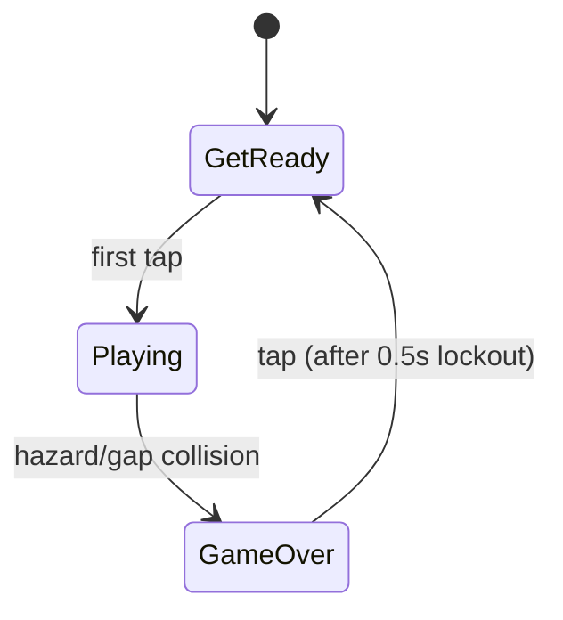
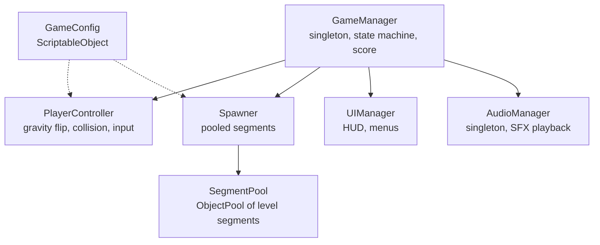

# Game Design Document - *Gravity Guy*

| | |
|---|---|
| **Working title** | Gravity Guy |
| **Team** | Tomer Levitski |
| **Genre** | Arcade / endless side-scrolling runner / reflex-timing score-chaser |
| **Target platform** | Mobile (Android/iOS touch), PC (Windows), standalone build |
| **Engine / Unity version** | Unity 6 (6000.3.12f1), URP, 3D |
| **Orientation & reference resolution** | Landscape, 1920x1080 reference |
| **Expected session length** | 15 seconds - 3 minutes |
| **Document version** | v0.1 - 2026-09-04 |

---

## 1. High Concept

The player controls a runner constantly moving right at auto-scrolling speed between floor and ceiling boundaries. One input-tap, click, or space will instantly flips the direction of gravity, causing the runner to fall upwards or downwards. Navigating through gaps and static obstacles keeps the player alive. Touch any obstacle or trail off-screen, die instantly.

### Design pillars

1. **One input, total commitment** - the only action is "flip gravity now." There is no jump height, no
   air control, no double-flip-to-cancel. This rules out any mechanic that needs a second button, a hold
   gesture, or analog input.
2. **Deterministic, learnable death** - gravity strength, flip speed, and runner speed are fixed constants
   for a given run; hazard layouts are drawn from a fixed pool of hand-authored segments, not fully random
   per-frame placement. This rules out random mid-air hazards and difficulty curves that punish the player
   for something they could not have anticipated.
3. **Never wait to retry** - death to restart is under 2 seconds, no fade-heavy game-over screen, no ads,
   no forced replay of an intro. This rules out any game-over flow with more than a single tap.

---

## 2. Reference & Inspiration

- **Primary reference:** *Gravity Guy* (Miniclip, 2010) - landscape endless runner,
  single-button gravity flip, procedurally chained level segments. **Taking:** the core flip-gravity loop,
  the landscape corridor framing, segment-based level construction. **Not taking:** the ragdoll death
  animation, the multi-chapter level art progression, time-trial/co-op modes
  build.
- **Video:** original *Gravity Guy* gameplay https://youtu.be/Sdb7xFNk_nw?si=4Qafi_C8fFtZ_V3A&t=17

---

## 3. Core Game Loop

**Moment-to-moment rules:**

- The runner moves right at a constant `runSpeed`; the player never controls horizontal movement directly.
- A tap **flips the direction of gravity** (down↔up) and re-parents the runner's "floor" reference from
  the level floor to the level ceiling, or back. It does not add velocity - it inverts the acceleration
  the runner is currently falling under.
- The flip input is only accepted while the runner is grounded on the floor or ceiling. A tap while the
  runner is mid-air (already falling toward the opposite surface) is ignored entirely - rapid clicking in
  the air does nothing. This removes the need for a flip-in-progress lock: the runner is simply ungrounded
  until it lands on the new surface, at which point the next tap is live again.
- A flip has two effects: the runner's sprite is mirrored vertically to match its new orientation,
  and gravity's direction inverts.
- Level segments (floor tiles, ceiling tiles, spike hazards, gaps) scroll toward the runner at `runSpeed`;
  the runner's world-space X position is otherwise fixed near the left third of the screen, camera-locked.
- **Scoring:** score increments continuously with distance traveled (`distance / distanceUnitsPerPoint`,
  updated once per `FixedUpdate`), not on discrete events - this keeps scoring fair and independent of
  segment layout.
- **Failure:** touching a spike hazard, or the runner's collider clearing the near-edge of a floor/ceiling
  tile with nothing beneath/above it (a fall into a gap on the wrong side), ends the run immediately. On
  death: physics/scrolling freeze, a 0.5 s input lockout starts, then a tap returns to `GetReady` and
  reloads the run.

### Parameters you will need to tune

| Parameter | What it controls | First guess |
|---|---|---|
| `runSpeed` | Constant horizontal scroll speed of the level (and runner's felt forward speed) | 6 u/s |
| `gravityStrength` | Downward/upward acceleration applied to the runner at all times | 20 u/s² |
| `segmentLength` | Width of one pooled level segment, in world units | 9.8 u |
| `hazardDensity` | Probability weight of a hazard-bearing segment vs. a clear segment when picking the next segment from the pool | 0.4 |
| `distanceUnitsPerPoint` | World units of travel per 1 point of score | 1 u = 1 pt |

**Where these live:** a `GameConfig` ScriptableObject referenced by `PlayerController` and `Spawner`, so
values can be tuned in the Inspector/asset without touching code or recompiling.

**Feel target:** a first-time player survives past the first hazard within five attempts; a player who has
played for two minutes can chain 15+ consecutive flips without dying.

---

## 4. Controls & Input

| Action | Keyboard / Mouse | Touch |
|---|---|---|
| Flip gravity | Space bar / Left mouse click | Tap anywhere on screen |
| Confirm / Restart on Game Over | Space bar / Left mouse click | Tap anywhere on screen |
| Pause | Escape | Pause button (top-corner UI) |

- Input is read via Unity's Input System in `Update` (as an `InputAction` callback), buffered into a single
  pending-flip flag, and consumed in `FixedUpdate` so a flip that arrives while grounded always lands on a
  physics step and is never silently dropped between frames. A tap that arrives while the runner is
  airborne finds the flag already gated off by the grounded check and is discarded, not queued - it will
  not trigger a flip once the runner lands.
- Taps that land on a UI button (pause button, restart button) are consumed by the UI element and do **not**
  also trigger a gravity flip - handled via Unity UI's own event system blocking raycasts to gameplay input.
- On the game-over screen, input is locked out for `0.5 s` after death (a dedicated timer, independent of
  the grounded-flip gating) to prevent the input that caused death from also instantly restarting the run.

---

## 5. Screens & UI

1. **Main Menu** - Title text "Gravity Guy", a "Tap to Start" prompt, best-score readout (from
   `PlayerPrefs`). No settings menu, no level select.
2. **Gameplay (GetReady/Playing)** - HUD only: current score (top-center), pause button (top-right corner).
   "GetReady" state additionally shows a "Tap to Flip" prompt overlay that disappears on first input.
3. **Game Over** - Final score, best score, a single "Tap to Retry" prompt. Appears after the 0.5 s
   lockout described in sections 3 and 4.

- **HUD during play:** score counter and pause button only. Deliberately absent: lives/health display,
  combo meter, minimap, ads/banner space.
- **Canvas setup:** Screen Space - Overlay, `CanvasScaler` set to *Scale With Screen Size*, reference
  resolution 1920 × 1080, match = 0.5 (balanced width/height scaling) so the HUD holds up across mobile
  aspect ratios.

---

## 6. Art & Audio

| Asset | Variants / frames | Source & licence | Use |
|---|---|---|---|
| Runner sprite | 8-frame run cycle | https://pzuh.itch.io/the-robot-free-sprite
| Floor/ceiling tile | 1 sprite | Kenney.nl "Platformer Pack Industrial" (CC0) | Level segments |
| Spike hazard | 1 sprite | Kenney.nl "Platformer Pack Industrial" (CC0) | Obstacles |
| Background | 1 sprite | Kenney.nl "Background Elements Remastered" (CC0) | Scrolling backdrop |
| Flip SFX | 1 clip | Kenney.nl "Digital Audio" (CC0) | Played on each gravity flip |
| Death SFX | 1 clip | Kenney.nl "Digital Audio" (CC0) | Played on hazard/gap collision |

**Licence note:** all placeholder assets are CC0 (Kenney.nl), free for both this private coursework build
and any future public release with no attribution required. If final art is instead hand-drawn or sourced
elsewhere for the graded submission, this table will be updated before submission - no asset will be used
under a licence that forbids coursework use.

**Technical art rules:** Point (no filter) import for all sprites, PPU 100, single `SpriteAtlas` for all
gameplay sprites, sorting layers back→front: `Background` → `LevelGeometry` → `Hazards` → `Player` → `UI`.

---

## 7. Technical Design

**Scenes:** one gameplay scene, `Game.unity`. Restart re-initializes runtime state (score, pooled segments,
runner position) via `GameManager` rather than reloading the scene.

**Packages / systems used:** Input System (touch + keyboard/mouse unification), Physics2D
(`Rigidbody2D`/`Collider2D` for runner and hazards).

**Target device:** Windows PC + Android phone for touch input.

**Architecture:**

| Script | Responsibility |
|---|---|
| `GameManager` | Singleton; owns the `GetReady → Playing → GameOver` state machine and the score value |
| `PlayerController` | Reads buffered input, checks grounded state, flips gravity and mirrors the runner sprite, detects hazard/gap collisions |
| `Spawner` | Requests/returns segments from `SegmentPool`, positions the next segment ahead of the runner |
| `SegmentPool` | Wraps Unity's `ObjectPool<T>` for level-segment prefabs; hazards and clear segments alike |
| `UIManager` | Updates HUD score text, shows/hides Menu/GetReady/GameOver panels |
| `AudioManager` | Singleton; plays flip/death SFX on `GameManager` state and event callbacks |
| `GameConfig` | ScriptableObject holding every tunable in section 3 parameter table |

### The course features you are implementing

1. **Object Pooling** - level segments (floor/ceiling tiles with and without spike hazards) are pulled from
   a `SegmentPool` (built on Unity's `ObjectPool<T>`) instead of instantiated/destroyed as they scroll past,
   because an endless runner spawns a segment every `segmentLength / runSpeed` seconds and per-spawn GC
   allocation would eventually stall the frame the player is mid-flip on - exactly the kind of dropped
   frame a one-input timing game cannot afford.
2. **Singletons** - `GameManager` and `AudioManager` are singletons (`static Instance`, one per scene) so
   any script (UI buttons, the player, the spawner) can report a death, request a restart, or play a sound
   without a manually-wired reference chain, which matters because the restart flow touches
   nearly every system at once.
3. **Coroutines** - the post-death `0.5 s` input lockout is driven by a coroutine on `GameManager`, since
   it is a simple timed sequence (wait, then unlock and show the Game Over prompt) that needs to run
   without blocking `Update`/`FixedUpdate` and without a full state-machine or animation setup.
4. **Mobile touch input** - the Input System's pointer/touch bindings drive the single flip action, and the
   HUD uses `CanvasScaler` *Scale With Screen Size* so the same build targets both the Windows PC
   and an Android touch device without separate input code paths.

---

## 8. Scope

### 8.1 MVP - the game is not a game without these

- [ ] Constant-speed runner with working gravity flip (floor↔ceiling) via keyboard/mouse and touch
- [ ] Pooled, endlessly-spawning level segments with at least 3 hazard layouts and 1 clear layout
- [ ] Hazard and gap collision detection ending the run
- [ ] Distance-based score, displayed live during play
- [ ] GetReady → Playing → GameOver state flow with sub-2-second restart
- [ ] Best score persisted via `PlayerPrefs`
- [ ] Working Android touch build

### 8.2 Polish - if the MVP is done and playable

- [ ] Camera shake on death
- [ ] Parallax scrolling background
- [ ] Flip/death SFX and simple background music
- [ ] Pause menu
- [ ] Simple runner run-cycle animation
- [ ] Low/high gravity zones - a level segment can carry a modified `gravityStrength` for its length
- [ ] Low/high speed zones - a level segment can carry a modified `runSpeed` for its length

**Note on the two zone features above:** pillar 2 (in section 1) commits the MVP to fixed gravity/speed constants
for a run. These zone features are a deliberate, scoped exception considered only once the MVP is solid -
each zone would still be hand-authored and tied to a specific pooled segment (not randomized), keeping
death learnable and fair even though the constant is no longer global for the whole run.

### 8.3 Explicitly out of scope - we are **not** building these

- Multiplayer, online leaderboards, or any networked/backend service
- Difficulty ramping, power-ups, multiple game modes, or level select
- Ragdoll physics or any death animation beyond a simple sprite/particle swap
- A save system beyond a single `PlayerPrefs` high score
- iOS builds (Android + Windows builds only)

---

## Changelog

| Version | Date | Change |
|---|---|---|
